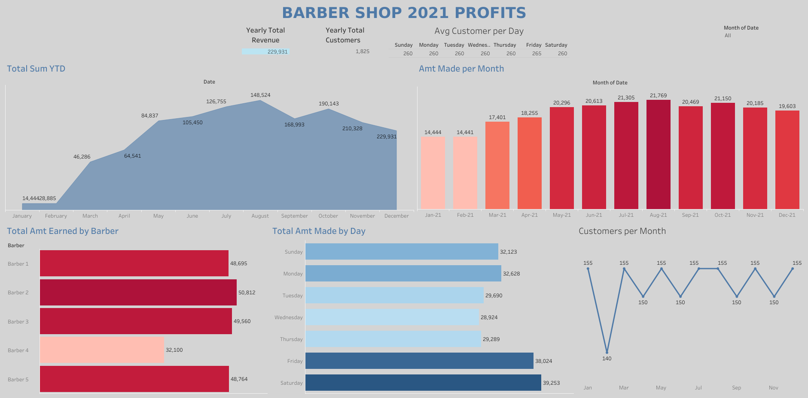

# Analysis of barber shop profits throughout 2021
Worked with the owner of a Barber Shop to analyze a year's worth of business data to summarize earnings throughout the year and measure some KPI's: monthly revenue, revenue per barber, revenue by day of the week, and count of customers throughout each month. We utilized python to do an EDA then Tableau to visualize the analysis. This analysis was used to determine if more barbers were needed for certain times of the year or if the customers per barber was distributed unequally. 

Some conclusions we made based of this year's dataset was that Friday and Saturdays tend to be the busiest, quantity of customers is relatively consistent on a month by month basis depending on how many days in the month there were, and that revenue increased during the summer reaching a peak in August.

You can find the dashboard of the barber shop analysis [here](https://public.tableau.com/views/ShopDashboard2021/ShopDashboard?:language=en-US&:display_count=n&:origin=viz_share_link).

